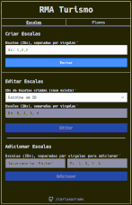
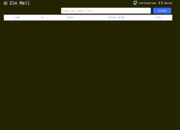
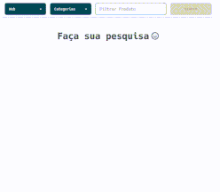
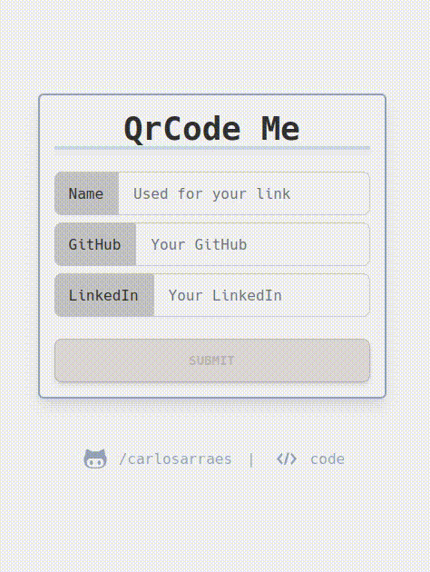

<h2 align="center">About Me</h2>

  Hey👋, i'm a passionate developer with strong problem-solving and communication skills. Focused on backend technologies, committed to delivering high-quality, reliable code. Looking to continue growing as a developer.

 
<h2 align="center">Keep In Touch</h2>

    
  
    
    

 
<h2 align="center">Projects</h2>
<h4 align="center">Type any e-mail/password(6 digits) to login.</h4>
 
<table bordercolor="#aaa" valign="top">
  <tr>
    <td width="50%" align="center">
      <h3 align="center">RMA Tourism</h3>
      

        
        

          
          
        

      

      
<strong>Frontend: React, TypeScript, Tailwind CSS</strong>

      
<strong>Backend: Crystal, Postgres, Kemal, Docker, GCP</strong>

      
The RMA Travel Planner is a web application designed to facilitate the planning and managing of interdimensional travels. It leverages the power of PostgreSQL, Crystal, and ViteJS to provide a user-friendly interface and reliable data management. 

    </td>
    <td width="50%" align="center">
      <h3 align="center">Zin Mail</h3>
      

        
        

          
          
        

      

      
<strong>Frontend: Vue3, TypeScript, Tailwind CSS</strong>

      
<strong>Backend: Go, Go-Chi, ZincSearch, Docker, AWS S3 EC2</strong>

      
A full-stack email search app using Vue3, Go, and ZincSearch. Efficiently search through 517k emails and view their content. Hosted on AWS. Frondend on S3 bucket, backend/db on EC2(container). Had to remove the app because AWS isn't free :(

    </td>
  </tr>
  <tr>
    <td width="50%" align="center">
      <h3 align="center">Unified Store</h3>
      

        
        

          
          
        

      

      
<strong>Frontend: React, TypeScript, Vitest, Tailwind CSS</strong>

      
<strong>Backend: Golang, Go-chi, GORM, Docker, MySQL</strong>

      
Unified Store is a modular web app for searching and displaying products from MercadoLivre and Buscape. Built with a React frontend and Go backend, it leverages a stateless API, web scraper, and PlanetScale database.

    </td>
    <td width="50%" align="center">
      <h3 align="center">QrCode Me</h3>
      

        
        

          
          
        

      

      
<strong>Frontend: React, Vitest, Tailwind CSS</strong>

      
<strong>Backend: Golang, Go Tests, Docker, PostgreSQL</strong>

      
QrCode Me is an app designed to easily share your GitHub or LinkedIn profiles. Simply fill out the provided forms and save the generated QR code for quick and easy sharing!

    </td>
  </tr>
</table>
 
<h2 align="center">Skills</h2>

  
  
  
  
  
  
  
  
  
  
  
  
  
  
  
  
  
  
  
  
  
  
  

