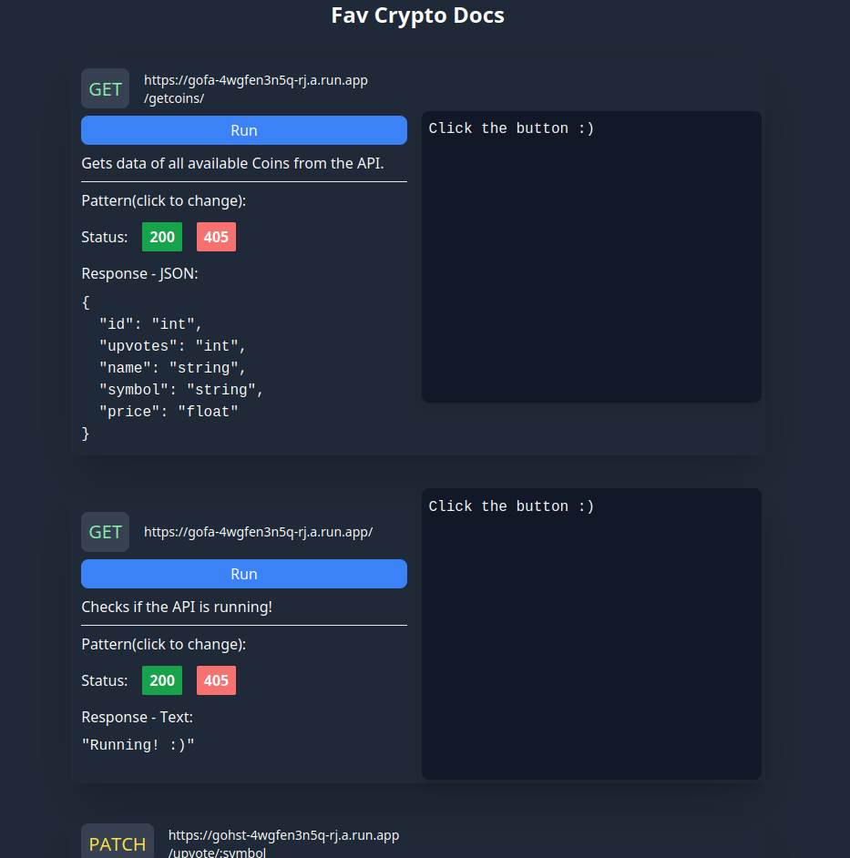

<h2 align="center">About Me</h2>

  Hey👋, i'm a passionate web developer with strong problem-solving and communication skills. Focused on backend technologies with almost a year of study and a background in management. Committed to delivering high-quality, reliable code. Looking to continue learning and growing as a developer.

 
<h2 align="center">Keep In Touch</h2>

    
  
    
    
    

 
<h2 align="center">Projects</h2>
<h4 align="center">Type any e-mail/password(6 digits) to login.</h4>
 
<table bordercolor="#aaa" valign="top">
  <tr>
    <td width="50%" align="center">
      <h3 align="center">FS Data</h3>

      

        

          
          
          
        

      

      
<strong>Frontend: React, Vitest, Tailwind CS</strong>

      
<strong>Backend: Golang, Go Tests, Docker, PostgreSQL</strong>

      
FS Data is a full-stack web application designed to display team progress data with a visually engaging and user-friendly interface. The front-end and back-end components of the project work together seamlessly through API endpoints. 
      The project includes tests performed with Vitest/MSW/Coverage-C8 for the front-end and route, connection, and handler tests for the back-end using a mocked database.

    </td>
    <td width="50%" align="center">
      <h3 align="center">Fav Cryptos</h3>
      

        
        

          
          
        

      

      
<strong>Golang, Go Tests, Docker, PostgreSQL, Typescript-React(Front)</strong>

      
A REST API using native Golang (without packages) that enables users to upvote 10 different cryptocurrencies by accessing an endpoint. This API updates the database by incrementing the count of votes for each crypto. I have containerized Golang and Postgres in Docker, and the Go App is running on Google Cloud Run while Postgres is hosted on ElephantSQL.

    </td>
  </tr>
  <tr>
    <td width="50%" align="center">
      <h3 align="center">RecipeHub</h3>
      

        
        

          
          
        

      

      
<strong>TypeScript, React, ContextAPI, Tailwind, Jest, RTL</strong>

      
A project that gets data from two different APIs (mealdb, cocktaildb). Uses localStorage as a "backend" so the user can save, check progress, favorite recipes(It was focused on mobile).

    </td>
    <td width="50%" valign="top">
      <h3 align="center">Trivia</h3>
      

        
      

      

        
        
      

      
<strong>TypeScript, React, ContextAPI, Tailwind, Jest, RTL</strong>

      
Trivia game, gets data from an API, checks user data with Gravatar for avatars. There's a ranking system and the points are based on difficulty and time(localStorage as backend).

    </td>
  </tr>
</table>
 
<h2 align="center">Skills</h2>

  
  
  
  
  
  
  
  
  
  
  
  
  
  
  
  
  
  
  
  
  
  
  
  
  
  
  
  
  
  
  
  

 
<h2 align="center">Code Stats</h2>

  

